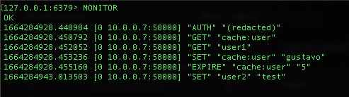

# REDIS

This repository is about REDIS.

Created by: Gustavo Vinicius de Morais

### Python Docker
```
docker-compose up -d --build
docker exec -it -u 0 python sh
python app.py

GET http://localhost/users

POST http://localhost/users
{
    "key":"user2",
    "value": "asfasdf"
}

```

### Redis Commands
```

redis-cli # access redis database

SET user gustavo # build a string key 'user' with value 'gustavo'

GET user # get the value of the key user

MSET user1 gustavo email1 gustavo@email.com # build many pairs of key value [key value]

MGET user1 email1 # get the values of multiple keys by once

DEL user # delete key

keys * # show all the keys

type user1 # shows the type of the value of the key

DUMP email1 # dumps a serialized value of some key

RESTORE test1 0 "\x00\x11gustavo@email.com\n\x00@\xe8\xa9\x14\x04\xab\x8b\xe2" # restore the serialized value to some key, with no expiration time [0]

EXISTS user1 # verify if some key exists, returns 1 for true and 0 for false

RENAME user1 user2 # renames a key to another name

SCAN 0 # show the keys, the 0 number is a cursor ID

SCAN 0 MATCH *us* COUNT 10 # brings 10 keys with the 'us' letters

OBJECT REFCOUNT user1 # return the qty of references of the pattern

OBJECT ENCODING user1 # encoding representation of the key value

OBJECT IDLETIME user1 # returns the amount of seconds that the object is without beeing called

INCR x # increments the key value plus one

DECR x # decrements the key value minus one

APPEND user vinicius # appends the vinicius value at the end of the key user

GETRANGE user 2 7 # get a string subset from start 2 until end 7

SETRANGE user 8 " vinicius" # appends string "vinicius" by position 8

expire cache:user 10 # set a time of 10 seconds expiration to a key

ttl cache:user # get the valie time in seconds of the key

CONFIG GET PORT # show the port where the redis is running

CONFIG SET REQUIREPASS gustavo # config a password with value gustavo

AUTH gustavo # auth the user with the password

INFO # show infos about the redis server

MONITOR # listen to events on redis

SLOWLOG GET # show some logs

```

### Redis RDB (is a redis snapshot of a point in time)
```
SAVE # creates a snapshot

SAVE 5000 # save snapshot after some change monitoring every 5 seconds

```

### Redis Hashs

It is a way to build a key with many fields

```

HSET user2 name gustavo pass 123 # creates a user2 key with name and pass fields

HGETALL user2 # get all fields from the user2 key

```

### Redis List

```

LPUSH list1 1 2 3 # builds a list pushing elements from the left

RPUSH list1 1 2 3 # builds a list pushing elements from the right

LRANGE list1 0 3 # list the elements from range 0 to 3

LLEN list1 # shows the size of the list

LRANGE list1 0 -1 # gets all elements from list1

```

